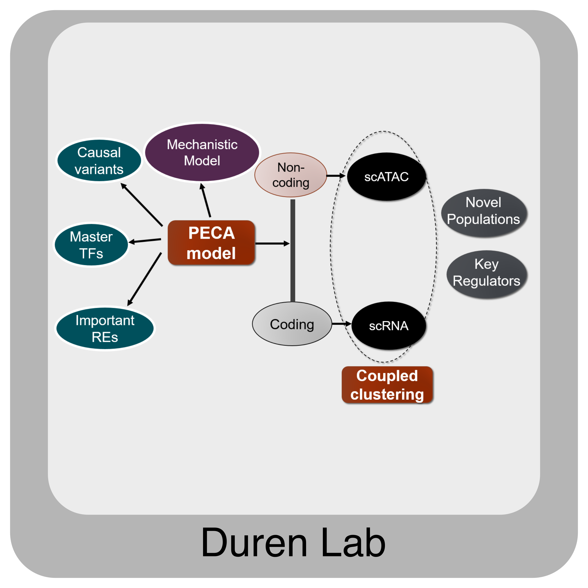
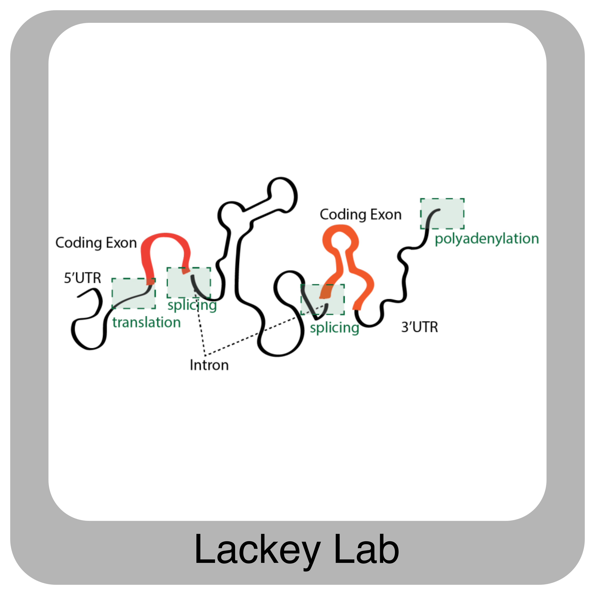
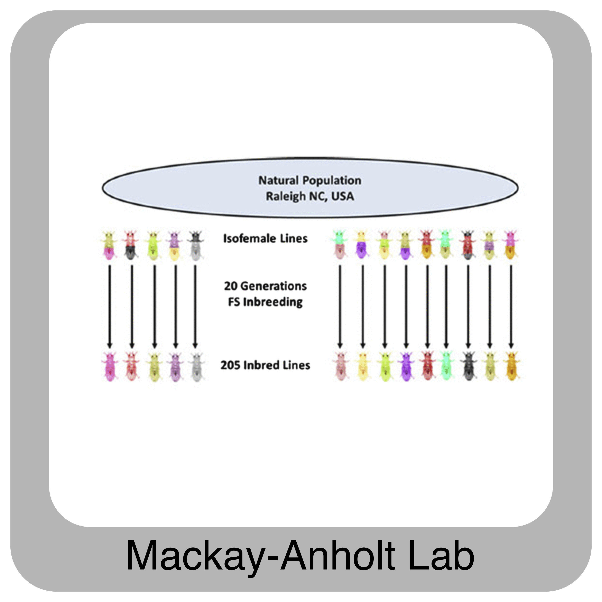
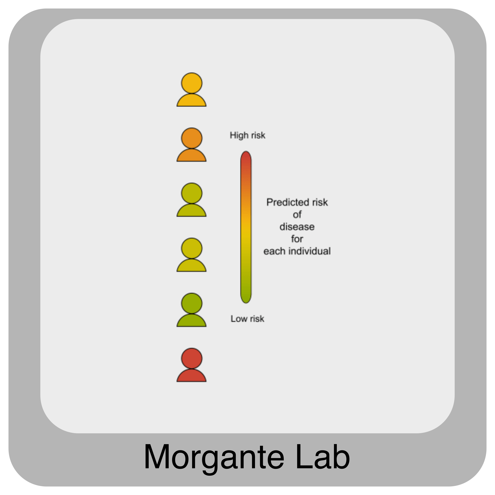

CHG
###

To learn more about the CHG, please visit our `website`_. Here are some additional links that might be useful:

- CHG Bioinformatics and Statistcial Lab `GitHub page`_
- `Greenwood Genetic Center`_

Labs (physically located) at the CHG:

   

For more information about other people working with the CHG, see the `"People" tab`_ of our `website`_.

.. _website: https://scienceweb.clemson.edu/chg/
.. _Greenwood Genetic Center: https://www.ggc.org/
.. _GitHub page: https://github.com/chg-bsl
.. _"People" tab: https://scienceweb.clemson.edu/chg/people/
