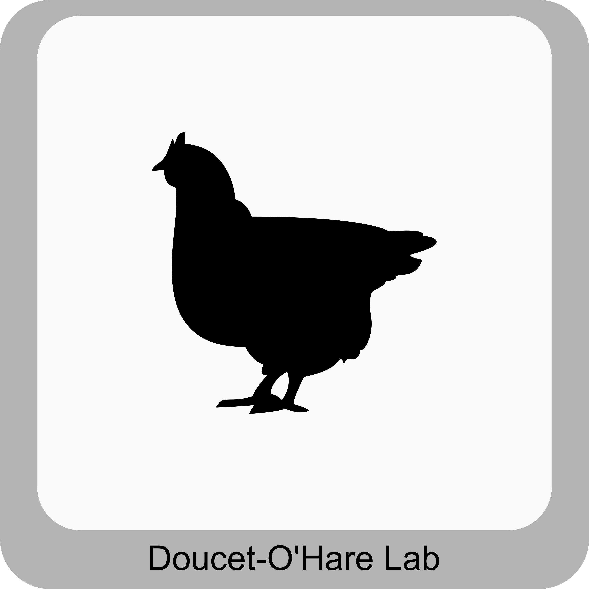
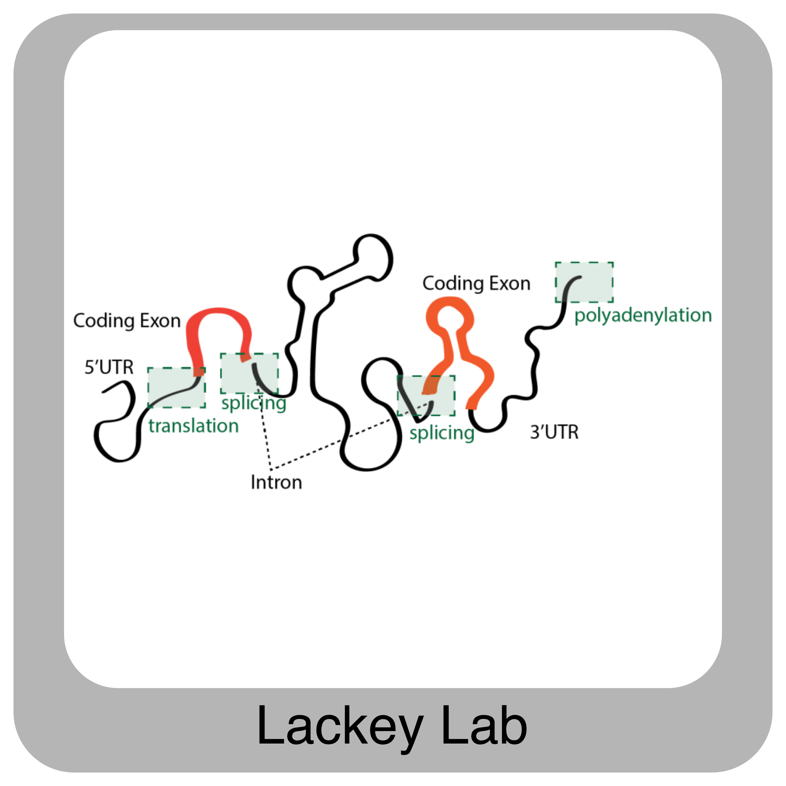
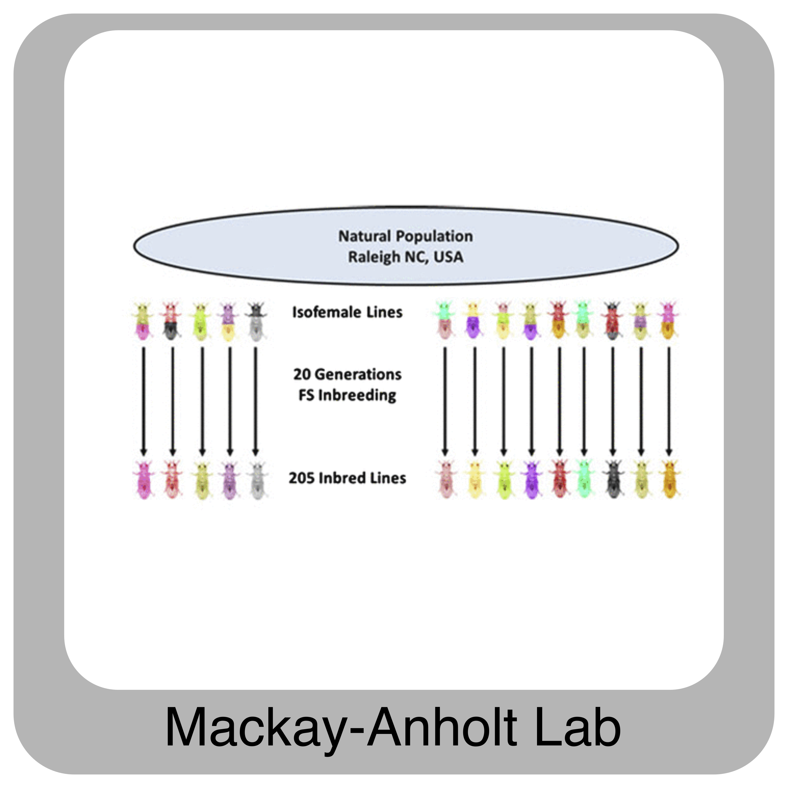
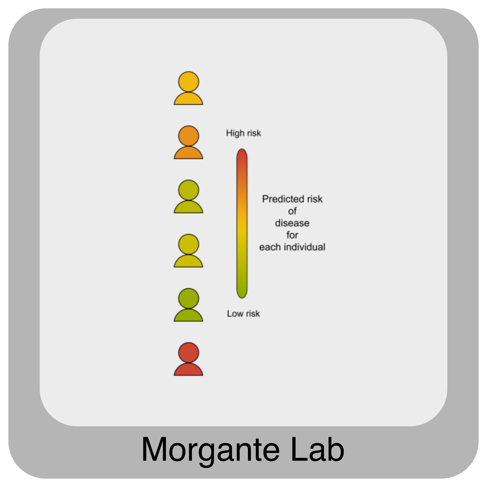

IHG links
#########

.. tip::

   **Contact** `Secretariat System Administrators`_ **with HPC Questions!**

   +------------------+----------------+--------------------+
   | `Vijay Shankar`_ | `John Poole`_  | `Maria E. Adonay`_ |
   +------------------+----------------+--------------------+

   .. code-block:: text

      vshanka@clemson.edu,jopoole@clemson.edu,madonay@clemson.edu

   .. raw:: html

      

   **Contact** `IHG Research Cores`_ **with Research Questions!**

   .. code-block:: text

      ihgcores@clemson.edu

----

To learn more about the IHG, please visit our `website`_. Here are some additional links that might be useful:

- `IHG Bioinformatics and Statistics Core Website`_
- `IHG Bioinformatics and Statistics Core GitHub Page`_

Labs (physically located) at Self Regional Hall in Greenwood, SC:
   

For more information about other people working with the IHG, see the `"People" tab`_ of the `IHG website`_.

----

.. raw:: html

   <a href="https://twitter.com/ClemsonCHG?ref_src=twsrc%5Etfw" class="twitter-follow-button tw-align-center" data-lang="en" data-show-count="false">Follow @ClemsonCHG</a>

----

.. raw:: html

   

      <a href="https://www.linkedin.com/company/clemson-ihg" target="_blank" rel="noopener"
         style="font-size:16px; font-weight:bold;">
         Follow Clemson IHG on LinkedIn
      </a>
   

.. raw:: html
   
   <a class="twitter-timeline tw-align-center" data-lang="en" data-width="400" data-height="800" data-theme="light" href="https://twitter.com/ClemsonCHG?ref_src=twsrc%5Etfw">Tweets by ClemsonCHG</a>  

----

.. _IHG website: https://scienceweb.clemson.edu/ihg/
.. _IHG Bioinformatics and Statistics Core Website: https://scienceweb.clemson.edu/ihg/research-cores/bsc-core/
.. _IHG Bioinformatics and Statistics Core GitHub Page: https://github.com/chg-bsl
.. _"People" tab: https://scienceweb.clemson.edu/ihg/people/
.. _Vijay Shankar: https://scienceweb.clemson.edu/chg/dr-vijay-shankar-2/
.. _John Poole: https://scienceweb.clemson.edu/chg/dr-john-poole/
.. _Maria E. Adonay: https://scienceweb.clemson.edu/chg/maria-adonay/
.. _Secretariat System Administrators: https://scienceweb.clemson.edu/ihg/research-cores/bsc-core/
.. _IHG Research Cores: https://scienceweb.clemson.edu/ihg/research-cores/
