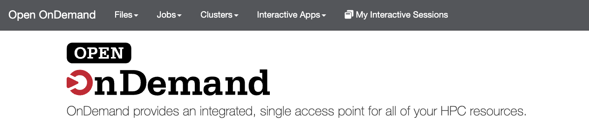

Secretariat OnDemand
====================

.. tip::

   **Contact the Secretariat Sys Admin Team with Questions!**

        - `Vijay Shankar`_
        - `John Poole`_
        - `Maria E. Adonay`_

   .. code-block:: text

      vshanka@clemson.edu,jopoole@clemson.edu,madonay@clemson.edu

----

`Open OnDemand`_ (OOD) is a web-based interface that is designed to be a user-friendly method for accessing HPC resources and services through your browser. To access Secretariat's OOD Page, navigate to `secretariat-master.clemson.edu`_ or `130.127.173.136`_ using your web browser. (Or click on the image, below!) Log in using your Secretariat credentials and complete DUO two-factor authentication when prompted.

.. note::

   Although you may encounter a warning message that says the connection is not private, it is safe to proceed to the site. To proceed, you may need to click a button labeled something like "Advanced" in the lower portion of the window. If you have any trouble during this process, send us a message!

After a successful login, you will arrive at the Dashboard, which provides quick access to Secretariat resources and utilities:

Dashboard Overview
------------------

+-------------------+--------------------------------------------------------------+
| Section           | Description                                                  |
+===================+==============================================================+
| Files             | Access your ``/home`` directory immediately, or navigate    |
|                   | to other permitted locations. Upload / download files, edit |
|                   | small text files, and manage basic file operations.         |
+-------------------+--------------------------------------------------------------+
| Jobs              | Create, submit, and monitor Slurm batch jobs on Secretariat.   |
+-------------------+--------------------------------------------------------------+
| Clusters          | Launch a browser-based terminal session on Secretariat.     |
|                   | (Note: Launches on the head node!)                          |
+-------------------+--------------------------------------------------------------+
| Interactive Apps  | Launch GUI-based scientific applications in the browser.     |
+-------------------+--------------------------------------------------------------+
| Help              | Access documentation and restart dashboard services if       |
|                   | needed for troubleshooting or development.                  |
+-------------------+--------------------------------------------------------------+

Interactive Apps
-----------------

These applications support genomics, data analysis, visualization, and reproducible research workflows:

+---------------------------+--------------------------------------------------------------------+
| App                       | Description                                                        |
+===========================+====================================================================+
| Cytoscape                 | Network analysis and visualization of gene / protein interactions, |
|                           | pathways, and omics networks.                                     |
+---------------------------+--------------------------------------------------------------------+
| DGRP2 Webserver           | Tools for Drosophila Genetics Reference Panel analyses and        |
|                           | population genomics workflows.                                    |
+---------------------------+--------------------------------------------------------------------+
| Dynamic Bic Flows         | Biclustering-based visualization for exploring complex gene       |
|                           | expression or phenotypic datasets.                                |
+---------------------------+--------------------------------------------------------------------+
| IGV                       | Genome browser for inspecting alignments, variants, and           |
|                           | annotation tracks.                                                |
+---------------------------+--------------------------------------------------------------------+
| Spyder                    | Python IDE for scripting, statistical analysis, and data          |
|                           | exploration workflows.                                            |
+---------------------------+--------------------------------------------------------------------+
| Secretariat Remote Desktop | Full Linux desktop environment for GUI-based applications and     |
|                           | interactive workflows.                                            |
+---------------------------+--------------------------------------------------------------------+
| ASC Seurat                | Single-cell RNA-seq analysis environment using Seurat for         |
|                           | clustering, visualization, and downstream interpretation.         |
+---------------------------+--------------------------------------------------------------------+
| Code Server               | Browser-based VS Code environment for editing scripts and         |
|                           | running computational pipelines.                                  |
+---------------------------+--------------------------------------------------------------------+
| Jupyter Notebook          | Interactive notebooks for Python/R analysis, visualization, and   |
|                           | reproducible research.                                            |
+---------------------------+--------------------------------------------------------------------+
| RStudio 1.4               | IDE for R-based statistical analysis and visualization.            |
+---------------------------+--------------------------------------------------------------------+
| ShinyR DAM                | Interactive R Shiny apps for data analysis and visualization       |
|                           | dashboards.                                                        |
+---------------------------+--------------------------------------------------------------------+
| iDEP & ShinyGO            | Web tools for differential expression analysis, enrichment, and    |
|                           | functional genomics interpretation.                                |
+---------------------------+--------------------------------------------------------------------+

List last updated: 11 May 2026.

.. _Open OnDemand: https://www.openondemand.org/
.. _secretariat-master.clemson.edu: https://secretariat-master.clemson.edu
.. _130.127.173.136: https://130.127.173.136
.. _Vijay Shankar: https://scienceweb.clemson.edu/chg/dr-vijay-shankar-2/
.. _John Poole: https://scienceweb.clemson.edu/chg/dr-john-poole/
.. _Maria E. Adonay: https://scienceweb.clemson.edu/chg/maria-adonay/
